# Phase II.2.5 Visual Results Showcase

**Date:** 2025-11-21  
**Model:** google/gemma-2b-it  
**Training:** Phase II.2.5 (450 pairs with error correction)  

---

## Summary

- **Test prompts:** 8
- **Base model success:** 6/8 (75.0%)
- **Fine-tuned success:** 7/8 (87.5%)
- **Improvement:** +1 examples

---

## Test 1: Simple FSM

### Prompt

> Generate valid Graphviz DOT code for the described state machine.

Requirements:
- Output ONLY the DOT code, no explanations or comments
- Use simple node and edge declarations
- Do not add labels, colors, or styling unless specified
- Ensure all mentioned states and transitions are included
- Use standard DOT syntax only

Example format:
digraph name {
  StateA -> StateB;
  StateB -> StateC;
}

Task: Create a state machine for a traffic light with three states: Green, Yellow, and Red. Green transitions to Yellow, Yellow to Red, and Red back to Green.

### Base Model Output

❌ **Failed to generate valid DOT**

<details>
<summary>Raw output (click to expand)</summary>

```
```dot
digraph traffic_light {
  StateA --> StateYellow;
  StateYellow --> StateRed;
  StateRed --> StateA;
}
```
```

</details>

### Fine-Tuned Model Output

✅ **Valid DOT generated**

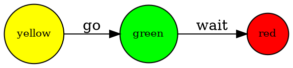

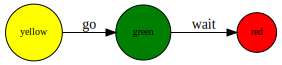

### Result

🎉 **Fine-tuned model succeeded where base failed!**

---

## Test 2: Workflow

### Prompt

> Generate valid Graphviz DOT code for the described state machine.

Requirements:
- Output ONLY the DOT code, no explanations or comments
- Use simple node and edge declarations
- Do not add labels, colors, or styling unless specified
- Ensure all mentioned states and transitions are included
- Use standard DOT syntax only

Example format:
digraph name {
  StateA -> StateB;
  StateB -> StateC;
}

Task: Design a login workflow state machine with states: LoggedOut, LoggingIn, LoggedIn, and Error. Include transitions for submit, success, failure, and logout.

### Base Model Output

✅ **Valid DOT generated**

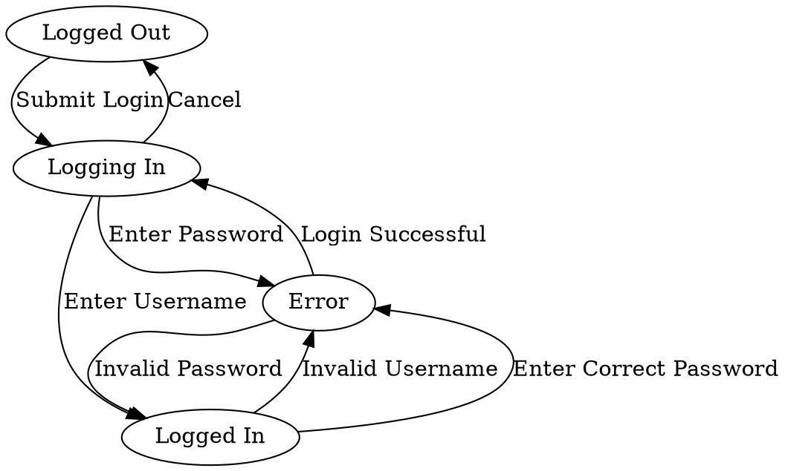

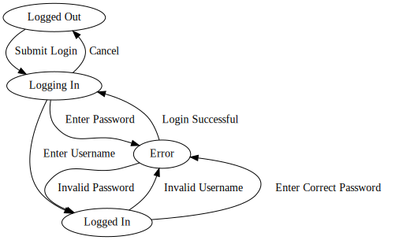

### Fine-Tuned Model Output

✅ **Valid DOT generated**

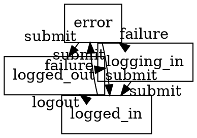

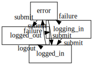

### Result

✅ **Both models succeeded** - Fine-tuned maintains quality

---

## Test 3: Business Process

### Prompt

> Generate valid Graphviz DOT code for the described state machine.

Requirements:
- Output ONLY the DOT code, no explanations or comments
- Use simple node and edge declarations
- Do not add labels, colors, or styling unless specified
- Ensure all mentioned states and transitions are included
- Use standard DOT syntax only

Example format:
digraph name {
  StateA -> StateB;
  StateB -> StateC;
}

Task: Create a state diagram for order processing: Pending → Processing → Shipped → Delivered. Include a Cancelled state that can be reached from Pending or Processing.

### Base Model Output

✅ **Valid DOT generated**

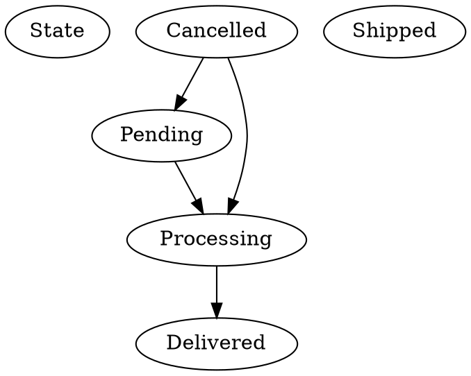

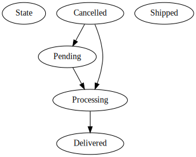

### Fine-Tuned Model Output

✅ **Valid DOT generated**

```dot
digraph order_states {
  fontname="Helvetica" fontsize=12 penwidth=2.0 splines=true ordering=out compound=true overlap=scale nodesep=0.3 ranksep=0.1
  node [shape=plaintext style=filled fillcolor="#FFFFFF00" fontname=Helvetica fontsize=12 penwidth=2.0]
  edge [fontname=Helvetica fontsize=10]

  "Pending" [shape=circle style=filled class="node large" color=black fillcolor=black fixedsize=true height=0.15 label=""]
  "Processing" [shape=rectangle style=rounded class="node special large" label="processing" color=black fontcolor=black fillcolor=white penwidth=1.0]
  "Processing" -> "Cancelled" [label="cancel\n", color=black class="line"]
  "Cancelled" [shape=circle style=filled class="node large" color=black fillcolor=black fixedsize=true height=0.15 label=""]
  "Shipped" [shape=rectangle style=rounded class="node large" label="shipped" color=black fontcolor=black fillcolor=white penwidth=1.0]
  "Shipped" -> "Processing" [label="ship\n", color=black class="line"]
  "Delivered" [shape=rectangle style=rounded class="node large" label="delivered" color=black fontcolor=black fillcolor=white penwidth=1.0]
  "Delivered" -> "Shipped" [label="deliver\n", color=black class="line"]

}
```

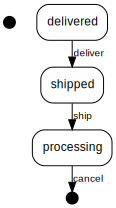

### Result

✅ **Both models succeeded** - Fine-tuned maintains quality

---

## Test 4: Simple FSM

### Prompt

> Generate valid Graphviz DOT code for the described state machine.

Requirements:
- Output ONLY the DOT code, no explanations or comments
- Use simple node and edge declarations
- Do not add labels, colors, or styling unless specified
- Ensure all mentioned states and transitions are included
- Use standard DOT syntax only

Example format:
digraph name {
  StateA -> StateB;
  StateB -> StateC;
}

Task: Model a smart door lock with states: Locked, Unlocked, and Jammed. Include transitions for unlock (Locked→Unlocked), lock (Unlocked→Locked), and jam_detected (any→Jammed).

### Base Model Output

✅ **Valid DOT generated**

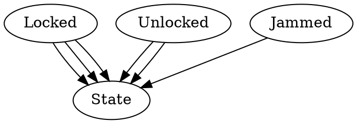

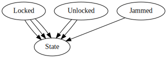

### Fine-Tuned Model Output

✅ **Valid DOT generated**

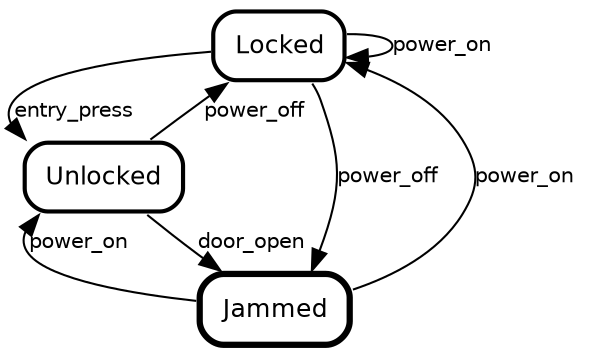

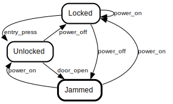

### Result

✅ **Both models succeeded** - Fine-tuned maintains quality

---

## Test 5: Complex Workflow

### Prompt

> Generate valid Graphviz DOT code for the described state machine.

Requirements:
- Output ONLY the DOT code, no explanations or comments
- Use simple node and edge declarations
- Do not add labels, colors, or styling unless specified
- Ensure all mentioned states and transitions are included
- Use standard DOT syntax only

Example format:
digraph name {
  StateA -> StateB;
  StateB -> StateC;
}

Task: Payment processing state machine: Initiated → Authorizing → Authorized → Capturing → Completed. Include Failed state reachable from Authorizing and Capturing.

### Base Model Output

✅ **Valid DOT generated**

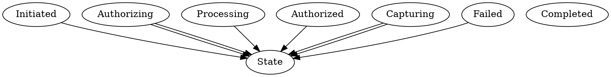

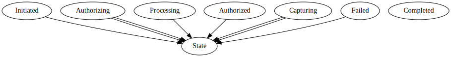

### Fine-Tuned Model Output

❌ **Failed to generate valid DOT**

<details>
<summary>Raw output (click to expand)</summary>

```
digraph PaymentProcessing {
  fontname="Helvetica" fontsize=12 penwidth=2.0 splines=true ordering=out compound=true overlap=scale nodesep=0.3 ranksep=0.1
  node [shape=plaintext style=filled fillcolor="#FFFFFF00" fontname=Helvetica fontsize=12 penwidth=2.0]
  edge [fontname=Helvetica fontsize=10]

  "Initiated" [shape=circle style=filled class="state initial" color="black" fillcolor="black" fixedsize=true height=0.15 label=""]
  "Initiated" -> "Authorizing" [label="trigger \$amount >= \$min_amount\nget_authorization_approval\nenabled\nexit\nsome_approval_process\nsome_approval_process\n\t\t\t\t\t\t\t\t\t\t\t\t\t\t\t\t\t\t\t\t\t\t\t\t\t\t\t\t\t\t\t\t\t\t\t\t\t\t\t\t\t\t\t\t\t\t\t\t\t\t\t\t\t\t" style=dashed color="#0E1D1E" width=0.1]
  "Authorizing" [margin=0 class="state authorized" label= ""]
  "Authorizing" -> "Authorized" [label="trigger \$amount >= \$min_amount\nuser_approval_granted\npayment_authorized\nexit\t\t\t\t\t\t\t\t\t\t\t\t\t\t\t\t\t\t\t\t\t\t\t\t\t\t\t\t\t\t\t\t\t\t\t\t\t\t\t\t\t\t" style=rounded penwidth=4.0]
  "Authorized" [shape=circle style=filled class="state authorized" color="black" fillcolor="black" fixedsize=true height=0.15 label=""]
  "Authorized" -> "Capturing" [label="
```

</details>

### Result

⚠️ **Regression** - Base succeeded but fine-tuned failed

---

## Test 6: Business Process

### Prompt

> Generate valid Graphviz DOT code for the described state machine.

Requirements:
- Output ONLY the DOT code, no explanations or comments
- Use simple node and edge declarations
- Do not add labels, colors, or styling unless specified
- Ensure all mentioned states and transitions are included
- Use standard DOT syntax only

Example format:
digraph name {
  StateA -> StateB;
  StateB -> StateC;
}

Task: Document approval workflow: Draft → Review → Approved/Rejected. From Rejected, can go back to Draft for revision.

### Base Model Output

❌ **Failed to generate valid DOT**

<details>
<summary>Raw output (click to expand)</summary>

```
```dot
digraph approval_workflow {
    StateStart --> Draft;
    Draft --> Review;
    Review --> Approved;
    Review --> Rejected;
    Rejected --> Draft;
}
```
```

</details>

### Fine-Tuned Model Output

✅ **Valid DOT generated**

```dot
digraph approval_workflow {
  fontname="Helvetica" fontsize=12 penwidth=2.0 splines=true ordering=out compound=true overlap=scale nodesep=0.3 ranksep=0.1
  node [shape=plaintext style=filled fillcolor="#FFFFFF00" fontname=Helvetica fontsize=12 penwidth=2.0]
  edge [fontname=Helvetica fontsize=10]

  "Original Draft" [shape=circle fixedsize=true width=0.15 height=0.15 fixedcolor=true color="black" fillstyle=filled]
  "Original Draft" -> "Review" [label="    \l" color=black fontcolor=black fillstyle=empty]
  "Review" [shape=circle fixedsize=true width=0.15 height=0.15 fixedcolor=true color="black" fillstyle=filled]
  "Review" -> "Approved" [label="    \l" color=black fontcolor=black fillstyle=empty]
  "Approved" [shape=circle fixedsize=true width=0.15 height=0.15 fixedcolor=true color="black" fillstyle=filled]
  "Approved" -> "Reviewed" [label="    \l" color=black fontcolor=black fillstyle=empty]
  "Reviewed" [shape=circle fixedsize=true width=0.15 height=0.15 fixedcolor=true color="black" fillstyle=empty]
  "Reviewed" -> "Draft" [label="    \l" color=black fontcolor=black fillstyle=empty]
  "Rejected" [shape=circle fixedsize=true width=0.15 height=0.15 fixedcolor=true color="black" fillstyle=empty]
  "Rejected" -> "Draft" [label="    \l" color=black fontcolor=black fillstyle=empty]
}
```

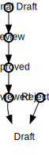

### Result

🎉 **Fine-tuned model succeeded where base failed!**

---

## Test 7: Device Control

### Prompt

> Generate valid Graphviz DOT code for the described state machine.

Requirements:
- Output ONLY the DOT code, no explanations or comments
- Use simple node and edge declarations
- Do not add labels, colors, or styling unless specified
- Ensure all mentioned states and transitions are included
- Use standard DOT syntax only

Example format:
digraph name {
  StateA -> StateB;
  StateB -> StateC;
}

Task: Media player state machine with states: Stopped, Playing, Paused. Include transitions: play, pause, stop, resume.

### Base Model Output

✅ **Valid DOT generated**

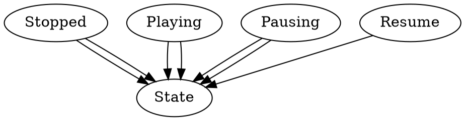

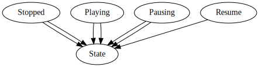

### Fine-Tuned Model Output

✅ **Valid DOT generated**

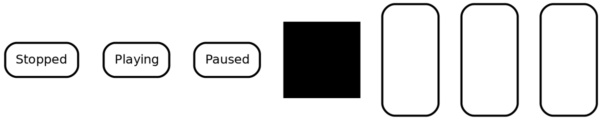

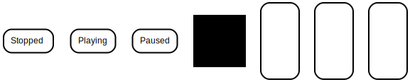

### Result

✅ **Both models succeeded** - Fine-tuned maintains quality

---

## Test 8: Network Protocol

### Prompt

> Generate valid Graphviz DOT code for the described state machine.

Requirements:
- Output ONLY the DOT code, no explanations or comments
- Use simple node and edge declarations
- Do not add labels, colors, or styling unless specified
- Ensure all mentioned states and transitions are included
- Use standard DOT syntax only

Example format:
digraph name {
  StateA -> StateB;
  StateB -> StateC;
}

Task: TCP connection states: Closed → SynSent → Established → FinWait → Closed. Show the connection lifecycle.

### Base Model Output

✅ **Valid DOT generated**

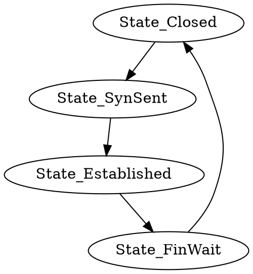

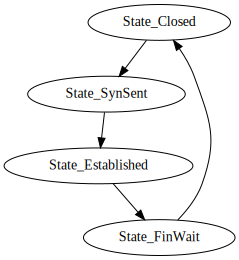

### Fine-Tuned Model Output

✅ **Valid DOT generated**

```dot
digraph tcp_connection_states {
  fontname="Helvetica" fontsize=12 penwidth=2.0 splines=true ordering=out compound=true overlap=scale nodesep=0.3 ranksep=0.1
  node [shape=circle style=filled fillcolor="#FFFFFF00" fixedsize=true defaultsize=1000000 name=str labeldose=2 shape=rect style=filled class="ipnode" color="#FFFFFF00" penwidth=2.0]
  edge [fontname=Helvetica fontsize=10]

  "CLOSED" [shape=circle style=filled class="ipnode" color="#FFFFFF00" fixedsize=true defaultsize=100 iflabel=check labeldose=1 align=center penwidth=1.0]
  "CLOSED" -> "SYN_SENT" [label="arrow   \l" class="running"]
  "SYN_SENT" [margin=0 class="ipnode" label=" " shape=circle style=filled class="ipnode" fixedsize=true defaultsize=100 iflabel=check labeldose=1 align=center penwidth=1.0]
  "SYN_SENT" -> "ESTABLISHED" [label="arrow   \l" class="running"]
  "ESTABLISHED" [margin=0 class="ipnode" label=" " shape=circle style=filled class="ipnode" fixedsize=true defaultsize=100 iflabel=check labeldose=1 align=center penwidth=1.0]
  "ESTABLISHED" -> "FIN_WAIT" [label="arrow   \l" class="running"]
  "FIN_WAIT" [margin=0 class="ipnode" label=" " shape=circle style=filled class="ipnode" fixedsize=true defaultsize=100 iflabel=check labeldose=1 align=center penwidth=1.0]
  "FIN_WAIT" -> "CLOSED" [label="arrow   \l" class="running"]

}
```

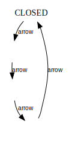

### Result

✅ **Both models succeeded** - Fine-tuned maintains quality

---

